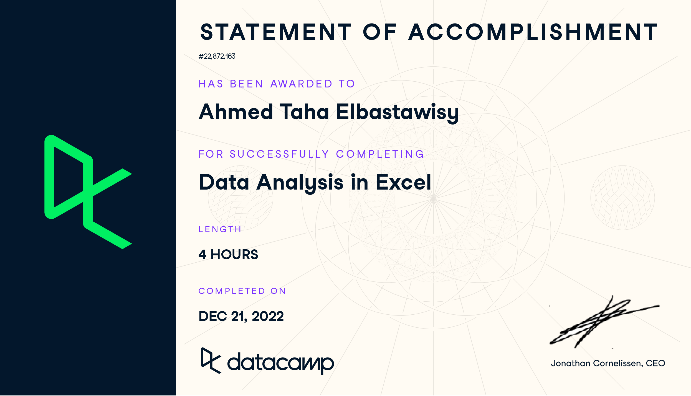

# Certificate Repository

This repository serves as a collection of my certifications in various data science, programming, and technical fields. Each certification showcases my commitment to continuous learning and skill development.

## Certificates

### Pandas Certificate from Kaggle

* Awarded: 2023-08-18

### Python for Data Science, AI & Development
[Python Certificate](Coursera%20LXVPKG86DYU5.pdf)
* Awarded: 2023-08-26

### SQL for Data Science
[SQL Certificate](Coursera%20SQL%20for%20Data%20Science.pdf)
* Awarded: 2023-08-07

### Data Analysis In Excel
[Excel Data Analysis Certificate](Data%20Analysis%20In%20Excel.pdf)
* Awarded: 2022-12-21

### Excel Fundamentals for Data Analysis
[Excel Fundamentals Certificate](Excel%20Fundamentals%20for%20Data%20Analysis.pdf)
* Awarded: 2023-08-10

### Introduction to SQL
[Introduction to SQL Certificate](Intro%20SQL.pdf)
* Awarded: 2022-09-24

### Tech Freelancing
[Tech Freelancing Certificate](Mahara%20Tech%20Freelancing.pdf)
* Awarded: 2023-04-05

<-- ### Other Certificates
- 
- 
- ... -->

## Repository Structure

- `Ahmed Taha - Pandas.png`: Certificate image for Pandas course from Kaggle.
- `Coursera Python for Data Science, AI & Development.pdf`: Certificate PDF for Python for Data Science, AI & Development course on Coursera.
- `Coursera SQL for Data Science.pdf`: Certificate PDF for SQL for Data Science course on Coursera.
- `Data Analysis In Excel.pdf`: Certificate PDF for Data Analysis in Excel course.
- `Excel Fundamentals for Data Analysis.pdf`: Certificate PDF for Excel Fundamentals for Data Analysis course.
- `Intro SQL.pdf`: Certificate PDF for Introduction to SQL course.
- `Mahara Tech Freelancing.pdf`: Certificate PDF for Tech Freelancing course.

## About Me

I am a dedicated learner passionate about data science, programming, and technical skills. These certifications reflect my journey in expanding my knowledge and expertise in various domains.

Feel free to reach out to me if you have any questions or if you'd like to connect. You can find more about me on my [LinkedIn Profile](https://www.linkedin.com/in/ahmed-taha-87b546207/)
 and my [personal website](https://ahmedtaha89.github.io/My_Portfolio/).

---
